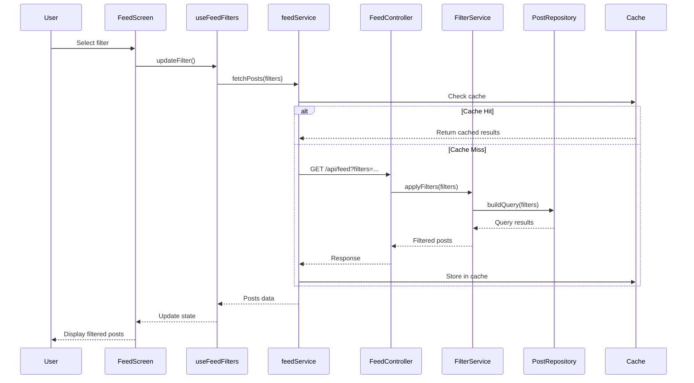

# Design Document: Advanced Feed Filters

## Overview

Hệ thống lọc bảng tin (Feed) tiên tiến với khả năng cá nhân hóa cao, kết hợp AI/ML recommendations, social signals, và location intelligence. Mục tiêu là tạo trải nghiệm vượt trội hơn Bump bằng cách cung cấp nhiều cách lọc thông minh và linh hoạt.

### Key Features
- **Smart Filter System**: Lọc đa chiều với khả năng kết hợp
- **AI-Powered Recommendations**: Gợi ý nội dung cá nhân hóa
- **Location Intelligence**: Lọc thông minh dựa trên vị trí
- **Social Signals**: Tận dụng mối quan hệ xã hội
- **Filter Presets**: Lưu và chia sẻ bộ lọc yêu thích
- **Real-time Performance**: Phản hồi nhanh <500ms

## Architecture

### High-Level Architecture

```
┌─────────────────────────────────────────────────────────────┐
│                        Client Layer                          │
├─────────────────────────────────────────────────────────────┤
│  FeedScreen (UI)                                             │
│    ├─ FilterBar Component                                    │
│    ├─ FilterBottomSheet Component                            │
│    ├─ PostList Component                                     │
│    └─ FilterPresetManager Component                          │
├─────────────────────────────────────────────────────────────┤
│  Hooks Layer                                                 │
│    ├─ useFeedFilters (filter state management)              │
│    ├─ useFeedPosts (data fetching with filters)             │
│    └─ useFilterPresets (preset management)                   │
├─────────────────────────────────────────────────────────────┤
│  Services Layer                                              │
│    ├─ feedService (API calls)                                │
│    ├─ filterService (filter logic)                           │
│    └─ cacheService (filter result caching)                   │
└─────────────────────────────────────────────────────────────┘
                            ↓ HTTP/REST
┌─────────────────────────────────────────────────────────────┐
│                        Server Layer                          │
├─────────────────────────────────────────────────────────────┤
│  API Layer                                                   │
│    └─ FeedController                                         │
│         ├─ GET /api/feed (with filter params)                │
│         ├─ GET /api/feed/presets                             │
│         └─ POST /api/feed/presets                            │
├─────────────────────────────────────────────────────────────┤
│  Service Layer                                               │
│    ├─ FeedService (business logic)                           │
│    ├─ FilterService (filter application)                     │
│    ├─ RecommendationService (AI/ML)                          │
│    └─ EngagementService (trending calculation)               │
├─────────────────────────────────────────────────────────────┤
│  Repository Layer                                            │
│    ├─ PostRepository (with dynamic queries)                  │
│    ├─ FilterPresetRepository                                 │
│    └─ UserInteractionRepository                              │
├─────────────────────────────────────────────────────────────┤
│  Caching Layer                                               │
│    ├─ Redis (filter results, trending posts)                 │
│    └─ In-Memory Cache (user preferences)                     │
└─────────────────────────────────────────────────────────────┘
                            ↓
┌─────────────────────────────────────────────────────────────┐
│                      Database Layer                          │
│  PostgreSQL                                                  │
│    ├─ posts (with indexes for filtering)                     │
│    ├─ filter_presets                                         │
│    ├─ user_interactions (for ML)                             │
│    └─ engagement_scores (denormalized)                       │
└─────────────────────────────────────────────────────────────┘
```

### Component Interaction Flow



## Components and Interfaces

### 1. Frontend Components

#### FilterBar Component
```typescript
interface FilterBarProps {
  activeFilters: FilterConfig[];
  onFilterSelect: (filter: FilterType) => void;
  onFilterRemove: (filterId: string) => void;
  presets: FilterPreset[];
  onPresetSelect: (presetId: string) => void;
}

// Quick access horizontal scrollable filter chips
const FilterBar: React.FC<FilterBarProps> = ({...}) => {
  return (
    <ScrollView horizontal>
      <FilterChip label="For You" active={...} />
      <FilterChip label="Friends" active={...} />
      <FilterChip label="Nearby" active={...} />
      <FilterChip label="+" onPress={openFilterSheet} />
    </ScrollView>
  );
};
```

#### FilterBottomSheet Component
```typescript
interface FilterBottomSheetProps {
  visible: boolean;
  onClose: () => void;
  activeFilters: FilterConfig[];
  onApplyFilters: (filters: FilterConfig[]) => void;
  onSavePreset: (name: string, filters: FilterConfig[]) => void;
}

// Full filter selection modal
const FilterBottomSheet: React.FC<FilterBottomSheetProps> = ({...}) => {
  return (
    <BottomSheet>
      <FilterSection title="Social">
        <FilterOption label="Friends" />
        <FilterOption label="Friends of Friends" />
      </FilterSection>
      <FilterSection title="Location">
        <FilterOption label="Nearby" />
        <FilterOption label="My City" />
      </FilterSection>
      {/* More sections... */}
    </BottomSheet>
  );
};
```

#### ActiveFiltersBar Component
```typescript
interface ActiveFiltersBarProps {
  filters: FilterConfig[];
  onRemove: (filterId: string) => void;
  onClear: () => void;
}

// Shows active filters with remove buttons
const ActiveFiltersBar: React.FC<ActiveFiltersBarProps> = ({...}) => {
  if (filters.length === 0) return null;
  
  return (
    <View style={styles.container}>
      {filters.map(filter => (
        <FilterTag 
          key={filter.id}
          label={filter.label}
          onRemove={() => onRemove(filter.id)}
        />
      ))}
      <ClearAllButton onPress={onClear} />
    </View>
  );
};
```

### 2. Custom Hooks

#### useFeedFilters Hook
```typescript
interface UseFeedFiltersReturn {
  filters: FilterConfig[];
  addFilter: (filter: FilterConfig) => void;
  removeFilter: (filterId: string) => void;
  clearFilters: () => void;
  toggleFilter: (filter: FilterConfig) => void;
  hasActiveFilters: boolean;
  filterCount: number;
}

const useFeedFilters = (): UseFeedFiltersReturn => {
  const [filters, setFilters] = useState<FilterConfig[]>([]);
  
  const addFilter = useCallback((filter: FilterConfig) => {
    setFilters(prev => {
      // Check for conflicts
      if (hasConflict(prev, filter)) {
        showConflictWarning();
        return prev;
      }
      return [...prev, filter];
    });
  }, []);
  
  // ... other methods
  
  return {
    filters,
    addFilter,
    removeFilter,
    clearFilters,
    toggleFilter,
    hasActiveFilters: filters.length > 0,
    filterCount: filters.length,
  };
};
```

#### useFeedPosts Hook (Enhanced)
```typescript
interface UseFeedPostsOptions {
  filters: FilterConfig[];
  sortBy?: SortOption;
  pageSize?: number;
}

interface UseFeedPostsReturn {
  posts: Post[];
  isLoading: boolean;
  error: Error | null;
  hasMore: boolean;
  loadMore: () => void;
  refresh: () => void;
  appliedFilters: FilterConfig[];
}

const useFeedPosts = (options: UseFeedPostsOptions): UseFeedPostsReturn => {
  const [posts, setPosts] = useState<Post[]>([]);
  const [isLoading, setIsLoading] = useState(false);
  const [page, setPage] = useState(0);
  
  // Fetch posts with filters
  const fetchPosts = useCallback(async (pageNum: number, append: boolean) => {
    setIsLoading(true);
    try {
      const response = await feedService.getFeed({
        filters: options.filters,
        sortBy: options.sortBy,
        page: pageNum,
        size: options.pageSize || 20,
      });
      
      if (append) {
        setPosts(prev => [...prev, ...response.content]);
      } else {
        setPosts(response.content);
      }
    } catch (error) {
      // Handle error
    } finally {
      setIsLoading(false);
    }
  }, [options.filters, options.sortBy]);
  
  // Refetch when filters change
  useEffect(() => {
    fetchPosts(0, false);
  }, [options.filters]);
  
  return {
    posts,
    isLoading,
    error: null,
    hasMore: true,
    loadMore: () => fetchPosts(page + 1, true),
    refresh: () => fetchPosts(0, false),
    appliedFilters: options.filters,
  };
};
```

#### useFilterPresets Hook
```typescript
interface FilterPreset {
  id: string;
  name: string;
  filters: FilterConfig[];
  isDefault: boolean;
  createdAt: Date;
}

interface UseFilterPresetsReturn {
  presets: FilterPreset[];
  savePreset: (name: string, filters: FilterConfig[]) => Promise<void>;
  deletePreset: (presetId: string) => Promise<void>;
  applyPreset: (presetId: string) => void;
  sharePreset: (presetId: string) => Promise<string>;
}

const useFilterPresets = (): UseFilterPresetsReturn => {
  const [presets, setPresets] = useState<FilterPreset[]>([]);
  
  const savePreset = async (name: string, filters: FilterConfig[]) => {
    const preset = await feedService.saveFilterPreset({ name, filters });
    setPresets(prev => [...prev, preset]);
  };
  
  // ... other methods
  
  return {
    presets,
    savePreset,
    deletePreset,
    applyPreset,
    sharePreset,
  };
};
```

### 3. Services

#### feedService
```typescript
interface FeedService {
  getFeed(params: FeedParams): Promise<PagedResponse<Post>>;
  getFilterPresets(): Promise<FilterPreset[]>;
  saveFilterPreset(preset: CreatePresetDTO): Promise<FilterPreset>;
  deleteFilterPreset(presetId: string): Promise<void>;
  shareFilterPreset(presetId: string): Promise<string>;
}

class FeedServiceImpl implements FeedService {
  async getFeed(params: FeedParams): Promise<PagedResponse<Post>> {
    // Build query parameters from filters
    const queryParams = this.buildQueryParams(params);
    
    // Check cache first
    const cacheKey = this.getCacheKey(queryParams);
    const cached = await cacheService.get(cacheKey);
    if (cached) return cached;
    
    // Fetch from API
    const response = await apiClient.get<PagedResponse<Post>>(
      '/feed',
      { params: queryParams }
    );
    
    // Cache result
    await cacheService.set(cacheKey, response, 60); // 60s TTL
    
    return response;
  }
  
  private buildQueryParams(params: FeedParams): Record<string, any> {
    const query: Record<string, any> = {
      page: params.page || 0,
      size: params.size || 20,
    };
    
    // Apply each filter
    params.filters.forEach(filter => {
      switch (filter.type) {
        case 'social':
          query.socialFilter = filter.value;
          break;
        case 'location':
          query.locationFilter = filter.value;
          query.radius = filter.radius;
          break;
        case 'timeRange':
          query.startDate = filter.startDate;
          query.endDate = filter.endDate;
          break;
        // ... more filter types
      }
    });
    
    return query;
  }
}

export const feedService = new FeedServiceImpl();
```

## Data Models

### Filter Configuration
```typescript
enum FilterType {
  SOCIAL = 'social',
  LOCATION = 'location',
  CONTENT = 'content',
  TIME = 'time',
  ENGAGEMENT = 'engagement',
  DISCOVERY = 'discovery',
}

enum SocialFilterValue {
  FRIENDS = 'friends',
  FRIENDS_OF_FRIENDS = 'friends_of_friends',
  FOLLOWING = 'following',
  MUTUAL_FRIENDS = 'mutual_friends',
}

enum LocationFilterValue {
  NEARBY = 'nearby',
  MY_CITY = 'my_city',
  PLACES_VISITED = 'places_visited',
  TRENDING_NEARBY = 'trending_nearby',
}

enum ContentFilterValue {
  PHOTOS_ONLY = 'photos_only',
  POPULAR = 'popular',
  RECENT = 'recent',
  LONG_POSTS = 'long_posts',
  CHECK_INS = 'check_ins',
}

enum TimeFilterValue {
  TODAY = 'today',
  THIS_WEEK = 'this_week',
  THIS_MONTH = 'this_month',
  CUSTOM = 'custom',
}

enum EngagementFilterValue {
  TRENDING = 'trending',
  MOST_LIKED = 'most_liked',
  MOST_DISCUSSED = 'most_discussed',
  VIRAL = 'viral',
}

interface FilterConfig {
  id: string;
  type: FilterType;
  value: string;
  label: string;
  params?: Record<string, any>; // Additional parameters
}

// Example filter configs
const exampleFilters: FilterConfig[] = [
  {
    id: 'filter_1',
    type: FilterType.SOCIAL,
    value: SocialFilterValue.FRIENDS,
    label: 'Bạn bè',
  },
  {
    id: 'filter_2',
    type: FilterType.LOCATION,
    value: LocationFilterValue.NEARBY,
    label: 'Gần đây',
    params: { radius: 5 }, // 5km
  },
  {
    id: 'filter_3',
    type: FilterType.CONTENT,
    value: ContentFilterValue.PHOTOS_ONLY,
    label: 'Chỉ ảnh',
  },
];
```

### Filter Preset
```typescript
interface FilterPreset {
  id: string;
  userId: string;
  name: string;
  description?: string;
  filters: FilterConfig[];
  isDefault: boolean;
  isPublic: boolean;
  shareToken?: string;
  usageCount: number;
  createdAt: Date;
  updatedAt: Date;
}

interface CreatePresetDTO {
  name: string;
  description?: string;
  filters: FilterConfig[];
  isPublic?: boolean;
}
```

### Feed Request/Response
```typescript
interface FeedParams {
  // Pagination
  page: number;
  size: number;
  
  // Filters
  filters: FilterConfig[];
  
  // Sorting
  sortBy?: 'recent' | 'popular' | 'recommended';
  
  // User context
  userId?: string;
  latitude?: number;
  longitude?: number;
}

interface FeedResponse {
  content: Post[];
  totalElements: number;
  totalPages: number;
  currentPage: number;
  pageSize: number;
  appliedFilters: FilterConfig[];
  suggestions?: FilterSuggestion[];
}

interface FilterSuggestion {
  filter: FilterConfig;
  reason: string;
  estimatedResults: number;
}
```

### Backend Entities

#### FilterPreset Entity (JPA)
```java
@Entity
@Table(name = "filter_presets")
public class FilterPreset {
    @Id
    @GeneratedValue(strategy = GenerationType.IDENTITY)
    private Long id;
    
    @ManyToOne
    @JoinColumn(name = "user_id", nullable = false)
    private User user;
    
    @Column(nullable = false, length = 100)
    private String name;
    
    @Column(columnDefinition = "TEXT")
    private String description;
    
    @Column(nullable = false, columnDefinition = "JSONB")
    @Type(JsonBinaryType.class)
    private List<FilterConfig> filters;
    
    @Column(name = "is_default")
    private Boolean isDefault = false;
    
    @Column(name = "is_public")
    private Boolean isPublic = false;
    
    @Column(name = "share_token", unique = true)
    private String shareToken;
    
    @Column(name = "usage_count")
    private Integer usageCount = 0;
    
    @CreationTimestamp
    @Column(name = "created_at")
    private LocalDateTime createdAt;
    
    @UpdateTimestamp
    @Column(name = "updated_at")
    private LocalDateTime updatedAt;
}
```

#### UserInteraction Entity (for ML)
```java
@Entity
@Table(name = "user_interactions", indexes = {
    @Index(name = "idx_user_post", columnList = "user_id, post_id"),
    @Index(name = "idx_user_timestamp", columnList = "user_id, timestamp")
})
public class UserInteraction {
    @Id
    @GeneratedValue(strategy = GenerationType.IDENTITY)
    private Long id;
    
    @ManyToOne
    @JoinColumn(name = "user_id", nullable = false)
    private User user;
    
    @ManyToOne
    @JoinColumn(name = "post_id", nullable = false)
    private Post post;
    
    @Enumerated(EnumType.STRING)
    @Column(nullable = false)
    private InteractionType type; // VIEW, LIKE, COMMENT, SHARE, SAVE
    
    @Column(name = "duration_seconds")
    private Integer durationSeconds; // Time spent viewing
    
    @Column(nullable = false)
    private LocalDateTime timestamp;
}
```


## Correctness Properties

*A property is a characteristic or behavior that should hold true across all valid executions of a system-essentially, a formal statement about what the system should do. Properties serve as the bridge between human-readable specifications and machine-verifiable correctness guarantees.*

### Property 1: Filter Application Consistency
*For any* set of filters, applying them to the feed should return only posts that match ALL filter criteria (AND logic)
**Validates: Requirements 1.3**

### Property 2: Filter Conflict Detection
*For any* two conflicting filters (e.g., "Friends" + "Discovery Mode"), the system should detect the conflict and prevent application or warn the user
**Validates: Requirements 9.4**

### Property 3: Cache Consistency
*For any* filter combination, if cached results exist and are not stale, fetching with same filters should return cached results without API call
**Validates: Requirements 11.1**

### Property 4: Preset Persistence
*For any* saved filter preset, retrieving and applying it should produce the same filter configuration as when it was saved
**Validates: Requirements 10.2**

### Property 5: Filter State Preservation
*For any* active filter set, navigating away and returning to feed should restore the same filter state
**Validates: Requirements 10.3**

### Property 6: Empty Result Handling
*For any* filter combination that produces zero results, the system should suggest alternative filters within 200ms
**Validates: Requirements 1.5, 11.3**

### Property 7: Performance Guarantee
*For any* filter application, the system should complete within 500ms for 95th percentile requests
**Validates: Requirements 11.1**

### Property 8: Location Filter Accuracy
*For any* location-based filter with radius R, all returned posts should be within distance R from user's location
**Validates: Requirements 3.1**

### Property 9: Social Filter Correctness
*For any* "Friends" filter, all returned posts should be authored by users in the requester's friend list
**Validates: Requirements 2.1**

### Property 10: Time Filter Boundaries
*For any* time-based filter with range [start, end], all returned posts should have createdAt within that range
**Validates: Requirements 6.1, 6.2, 6.3**

## Error Handling

### Client-Side Error Handling

```typescript
class FilterError extends Error {
  constructor(
    message: string,
    public code: FilterErrorCode,
    public filters?: FilterConfig[]
  ) {
    super(message);
    this.name = 'FilterError';
  }
}

enum FilterErrorCode {
  CONFLICT = 'FILTER_CONFLICT',
  INVALID_COMBINATION = 'INVALID_COMBINATION',
  NETWORK_ERROR = 'NETWORK_ERROR',
  CACHE_ERROR = 'CACHE_ERROR',
  PRESET_NOT_FOUND = 'PRESET_NOT_FOUND',
}

// Error handling in useFeedFilters
const addFilter = useCallback((filter: FilterConfig) => {
  try {
    // Validate filter
    if (!isValidFilter(filter)) {
      throw new FilterError(
        'Invalid filter configuration',
        FilterErrorCode.INVALID_COMBINATION,
        [filter]
      );
    }
    
    // Check for conflicts
    const conflict = findConflict(filters, filter);
    if (conflict) {
      throw new FilterError(
        `Filter "${filter.label}" conflicts with "${conflict.label}"`,
        FilterErrorCode.CONFLICT,
        [filter, conflict]
      );
    }
    
    setFilters(prev => [...prev, filter]);
  } catch (error) {
    if (error instanceof FilterError) {
      // Show user-friendly error message
      showToast({
        type: 'error',
        message: error.message,
        action: error.code === FilterErrorCode.CONFLICT 
          ? { label: 'Remove conflict', onPress: () => removeFilter(conflict.id) }
          : undefined
      });
    }
    throw error;
  }
}, [filters]);
```

### Server-Side Error Handling

```java
@RestControllerAdvice
public class FeedControllerAdvice {
    
    @ExceptionHandler(InvalidFilterException.class)
    public ResponseEntity<ErrorResponse> handleInvalidFilter(
        InvalidFilterException ex
    ) {
        return ResponseEntity
            .badRequest()
            .body(ErrorResponse.builder()
                .code("INVALID_FILTER")
                .message(ex.getMessage())
                .suggestions(ex.getSuggestions())
                .build());
    }
    
    @ExceptionHandler(FilterConflictException.class)
    public ResponseEntity<ErrorResponse> handleFilterConflict(
        FilterConflictException ex
    ) {
        return ResponseEntity
            .badRequest()
            .body(ErrorResponse.builder()
                .code("FILTER_CONFLICT")
                .message(ex.getMessage())
                .conflictingFilters(ex.getConflictingFilters())
                .build());
    }
}
```

## Testing Strategy

### Unit Tests

#### Filter Logic Tests
```typescript
describe('useFeedFilters', () => {
  it('should add filter correctly', () => {
    const { result } = renderHook(() => useFeedFilters());
    
    act(() => {
      result.current.addFilter({
        id: 'f1',
        type: FilterType.SOCIAL,
        value: SocialFilterValue.FRIENDS,
        label: 'Friends',
      });
    });
    
    expect(result.current.filters).toHaveLength(1);
    expect(result.current.hasActiveFilters).toBe(true);
  });
  
  it('should detect filter conflicts', () => {
    const { result } = renderHook(() => useFeedFilters());
    
    act(() => {
      result.current.addFilter({
        id: 'f1',
        type: FilterType.SOCIAL,
        value: SocialFilterValue.FRIENDS,
        label: 'Friends',
      });
    });
    
    expect(() => {
      act(() => {
        result.current.addFilter({
          id: 'f2',
          type: FilterType.DISCOVERY,
          value: 'discovery_mode',
          label: 'Discovery',
        });
      });
    }).toThrow(FilterError);
  });
});
```

#### Filter Service Tests
```typescript
describe('feedService', () => {
  it('should build correct query params from filters', () => {
    const filters: FilterConfig[] = [
      { id: 'f1', type: FilterType.SOCIAL, value: 'friends', label: 'Friends' },
      { id: 'f2', type: FilterType.LOCATION, value: 'nearby', label: 'Nearby', params: { radius: 5 } },
    ];
    
    const params = feedService['buildQueryParams']({ filters, page: 0, size: 20 });
    
    expect(params).toEqual({
      page: 0,
      size: 20,
      socialFilter: 'friends',
      locationFilter: 'nearby',
      radius: 5,
    });
  });
  
  it('should use cache when available', async () => {
    const mockData = { content: [], totalElements: 0 };
    jest.spyOn(cacheService, 'get').mockResolvedValue(mockData);
    jest.spyOn(apiClient, 'get').mockResolvedValue(mockData);
    
    await feedService.getFeed({ filters: [], page: 0, size: 20 });
    
    expect(cacheService.get).toHaveBeenCalled();
    expect(apiClient.get).not.toHaveBeenCalled();
  });
});
```

### Property-Based Tests

#### Property Test: Filter Consistency
```java
@Property
void filterApplicationShouldReturnOnlyMatchingPosts(
    @ForAll List<Post> allPosts,
    @ForAll FilterConfig filter
) {
    // Apply filter
    List<Post> filtered = filterService.applyFilter(allPosts, filter);
    
    // Verify all results match filter
    for (Post post : filtered) {
        assertTrue(
            filterService.matchesFilter(post, filter),
            "Post " + post.getId() + " should match filter " + filter.getType()
        );
    }
}
```

#### Property Test: Cache Consistency
```java
@Property
void cachedResultsShouldMatchFreshResults(
    @ForAll List<FilterConfig> filters,
    @ForAll("validPageParams") int page,
    @ForAll("validPageParams") int size
) {
    // Clear cache
    cacheService.clear();
    
    // First call (cache miss)
    FeedResponse fresh = feedService.getFeed(filters, page, size);
    
    // Second call (cache hit)
    FeedResponse cached = feedService.getFeed(filters, page, size);
    
    // Results should be identical
    assertEquals(fresh.getContent(), cached.getContent());
    assertEquals(fresh.getTotalElements(), cached.getTotalElements());
}
```

### Integration Tests

```typescript
describe('Feed Filters Integration', () => {
  it('should filter posts by friends and location', async () => {
    // Setup: Create test data
    const user = await createTestUser();
    const friend = await createTestUser();
    await createFriendship(user.id, friend.id);
    
    const nearbyPost = await createTestPost({
      userId: friend.id,
      latitude: user.latitude + 0.01, // ~1km away
      longitude: user.longitude + 0.01,
    });
    
    const farPost = await createTestPost({
      userId: friend.id,
      latitude: user.latitude + 1, // ~100km away
      longitude: user.longitude + 1,
    });
    
    // Apply filters
    const response = await feedService.getFeed({
      filters: [
        { type: 'social', value: 'friends' },
        { type: 'location', value: 'nearby', params: { radius: 5 } },
      ],
      page: 0,
      size: 20,
    });
    
    // Verify
    expect(response.content).toContainEqual(nearbyPost);
    expect(response.content).not.toContainEqual(farPost);
  });
});
```

## Performance Optimization

### 1. Database Indexing Strategy

```sql
-- Composite indexes for common filter combinations
CREATE INDEX idx_posts_user_created 
ON posts(user_id, created_at DESC);

CREATE INDEX idx_posts_location_created 
ON posts USING GIST(ll_to_earth(latitude, longitude), created_at DESC);

CREATE INDEX idx_posts_privacy_created 
ON posts(privacy, created_at DESC) 
WHERE privacy = 'PUBLIC';

-- Partial index for trending posts
CREATE INDEX idx_posts_trending 
ON posts(engagement_score DESC, created_at DESC)
WHERE created_at > NOW() - INTERVAL '7 days';

-- Index for photo posts
CREATE INDEX idx_posts_with_images 
ON posts(created_at DESC)
WHERE EXISTS (
  SELECT 1 FROM post_images 
  WHERE post_images.post_id = posts.id
);
```

### 2. Caching Strategy

```typescript
interface CacheStrategy {
  // Cache key generation
  getCacheKey(filters: FilterConfig[], page: number): string;
  
  // TTL based on filter type
  getTTL(filters: FilterConfig[]): number;
  
  // Cache invalidation
  invalidate(userId: string, postId?: string): Promise<void>;
}

class FeedCacheStrategy implements CacheStrategy {
  getCacheKey(filters: FilterConfig[], page: number): string {
    const filterHash = this.hashFilters(filters);
    return `feed:${filterHash}:page:${page}`;
  }
  
  getTTL(filters: FilterConfig[]): number {
    // Dynamic TTL based on filter type
    const hasTimeFilter = filters.some(f => f.type === FilterType.TIME);
    const hasLocationFilter = filters.some(f => f.type === FilterType.LOCATION);
    
    if (hasTimeFilter && filters.find(f => f.value === 'today')) {
      return 60; // 1 minute for "today" filter
    }
    
    if (hasLocationFilter) {
      return 300; // 5 minutes for location-based
    }
    
    return 600; // 10 minutes default
  }
  
  async invalidate(userId: string, postId?: string): Promise<void> {
    // Invalidate user's feed caches when they create/delete post
    const pattern = `feed:*user:${userId}*`;
    await cacheService.deletePattern(pattern);
    
    // Invalidate friend feeds
    const friendIds = await friendshipService.getFriendIds(userId);
    for (const friendId of friendIds) {
      const friendPattern = `feed:*user:${friendId}*`;
      await cacheService.deletePattern(friendPattern);
    }
  }
}
```

### 3. Query Optimization

```java
@Service
public class FilterService {
    
    public Specification<Post> buildSpecification(List<FilterConfig> filters) {
        return (root, query, cb) -> {
            List<Predicate> predicates = new ArrayList<>();
            
            for (FilterConfig filter : filters) {
                switch (filter.getType()) {
                    case SOCIAL:
                        predicates.add(buildSocialPredicate(root, cb, filter));
                        break;
                    case LOCATION:
                        predicates.add(buildLocationPredicate(root, cb, filter));
                        break;
                    case TIME:
                        predicates.add(buildTimePredicate(root, cb, filter));
                        break;
                    // ... more filter types
                }
            }
            
            // Combine with AND
            return cb.and(predicates.toArray(new Predicate[0]));
        };
    }
    
    private Predicate buildSocialPredicate(
        Root<Post> root, 
        CriteriaBuilder cb, 
        FilterConfig filter
    ) {
        if ("friends".equals(filter.getValue())) {
            // Use subquery for friend IDs
            Subquery<UUID> friendQuery = query.subquery(UUID.class);
            Root<Friendship> friendship = friendQuery.from(Friendship.class);
            friendQuery.select(friendship.get("friendId"))
                .where(cb.equal(friendship.get("userId"), currentUserId));
            
            return root.get("user").get("id").in(friendQuery);
        }
        // ... other social filters
    }
    
    private Predicate buildLocationPredicate(
        Root<Post> root,
        CriteriaBuilder cb,
        FilterConfig filter
    ) {
        if ("nearby".equals(filter.getValue())) {
            Double radius = (Double) filter.getParams().get("radius");
            Double userLat = (Double) filter.getParams().get("latitude");
            Double userLng = (Double) filter.getParams().get("longitude");
            
            // Use PostgreSQL earthdistance
            return cb.lessThanOrEqualTo(
                cb.function(
                    "earth_distance",
                    Double.class,
                    cb.function("ll_to_earth", Object.class, 
                        root.get("latitude"), root.get("longitude")),
                    cb.function("ll_to_earth", Object.class,
                        cb.literal(userLat), cb.literal(userLng))
                ),
                radius * 1000 // Convert km to meters
            );
        }
        // ... other location filters
    }
}
```

### 4. Pagination Optimization

```typescript
// Cursor-based pagination for better performance
interface CursorPaginationParams {
  cursor?: string; // Base64 encoded cursor
  limit: number;
}

interface CursorPaginationResponse<T> {
  items: T[];
  nextCursor?: string;
  hasMore: boolean;
}

// In useFeedPosts hook
const useFeedPostsCursor = (filters: FilterConfig[]) => {
  const [posts, setPosts] = useState<Post[]>([]);
  const [cursor, setCursor] = useState<string | undefined>();
  
  const loadMore = async () => {
    const response = await feedService.getFeedCursor({
      filters,
      cursor,
      limit: 20,
    });
    
    setPosts(prev => [...prev, ...response.items]);
    setCursor(response.nextCursor);
  };
  
  return { posts, loadMore, hasMore: !!cursor };
};
```

## API Specification

### GET /api/feed

**Query Parameters:**
```
page: number (default: 0)
size: number (default: 20, max: 100)
socialFilter: string (friends|friends_of_friends|following|mutual_friends)
locationFilter: string (nearby|my_city|places_visited|trending_nearby)
radius: number (km, for nearby filter)
contentFilter: string (photos_only|popular|recent|long_posts|check_ins)
timeFilter: string (today|this_week|this_month|custom)
startDate: ISO8601 (for custom time filter)
endDate: ISO8601 (for custom time filter)
engagementFilter: string (trending|most_liked|most_discussed|viral)
sortBy: string (recent|popular|recommended)
```

**Response:**
```json
{
  "content": [
    {
      "id": 123,
      "user": {...},
      "content": "...",
      "images": [...],
      "likes": 45,
      "comments": 12,
      "createdAt": "2026-03-07T10:00:00Z",
      "location": {...}
    }
  ],
  "totalElements": 150,
  "totalPages": 8,
  "currentPage": 0,
  "pageSize": 20,
  "appliedFilters": [
    {
      "type": "social",
      "value": "friends",
      "label": "Bạn bè"
    }
  ],
  "suggestions": [
    {
      "filter": {
        "type": "location",
        "value": "nearby",
        "label": "Gần đây"
      },
      "reason": "Có 23 bài viết từ bạn bè gần bạn",
      "estimatedResults": 23
    }
  ]
}
```

### GET /api/feed/presets

**Response:**
```json
{
  "presets": [
    {
      "id": "preset_1",
      "name": "Bạn bè gần đây",
      "description": "Bài viết từ bạn bè trong khu vực",
      "filters": [...],
      "isDefault": true,
      "usageCount": 45,
      "createdAt": "2026-01-01T00:00:00Z"
    }
  ]
}
```

### POST /api/feed/presets

**Request Body:**
```json
{
  "name": "My Custom Filter",
  "description": "Optional description",
  "filters": [
    {
      "type": "social",
      "value": "friends"
    },
    {
      "type": "content",
      "value": "photos_only"
    }
  ],
  "isPublic": false
}
```

**Response:**
```json
{
  "id": "preset_123",
  "name": "My Custom Filter",
  "filters": [...],
  "shareToken": "abc123def456",
  "createdAt": "2026-03-07T10:00:00Z"
}
```

## Migration Path

### Phase 1: Core Filters (Week 1-2)
- Implement basic filter types: Social, Location, Time
- Update PostRepository with filter methods
- Create FilterService
- Update FeedController to accept filter params
- Basic caching with Redis

### Phase 2: Advanced Filters (Week 3-4)
- Implement Content and Engagement filters
- Add filter presets functionality
- Implement filter conflict detection
- Performance optimization with indexes

### Phase 3: AI/ML Features (Week 5-6)
- Implement "For You" recommendations (simple version)
- Add Discovery Mode
- User interaction tracking
- Basic recommendation algorithm

### Phase 4: Polish & Optimization (Week 7-8)
- Filter insights and analytics
- Shareable presets
- Advanced caching strategies
- Performance tuning
- Comprehensive testing

## Conclusion

Hệ thống Advanced Feed Filters được thiết kế để vượt trội hơn Bump bằng cách cung cấp:
- Nhiều tùy chọn lọc linh hoạt và mạnh mẽ
- Khả năng kết hợp filters thông minh
- AI-powered recommendations
- Performance cao với caching và indexing tối ưu
- UX mượt mà với skeleton loading và error handling tốt

Thiết kế này đảm bảo scalability, maintainability, và extensibility cho tương lai.
